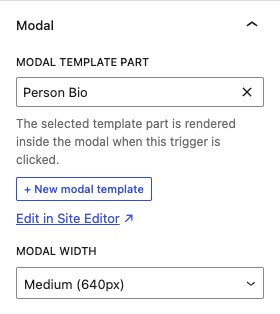
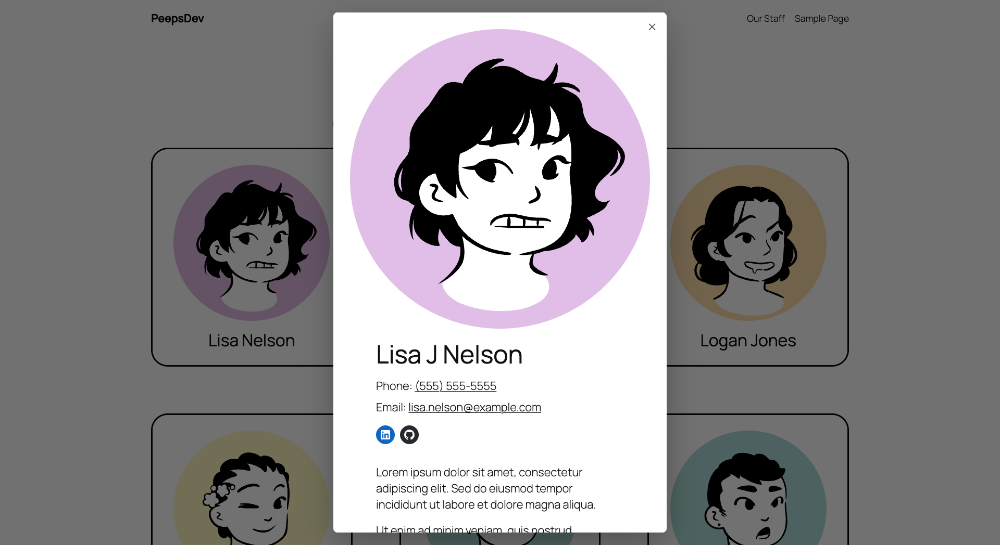

# Modal Templates

A WordPress block plugin that lets you design modal contents as template parts in the Site Editor, then attach them to any button or group block as a trigger. 

## Screenshots




## How it works

1. You design modal content as a **template part** in the Site Editor
2. WordPress pre-renders that template part into a hidden `<template>` element inline on the page
3. When a trigger is clicked, the frontend JS clones that element into the modal shell

Because rendering happens inside the `render_block` filter, it runs within the active post context. This means a single template part can render dynamic, per-post content when used inside a Query Loop — each post gets its own pre-rendered modal with that post's data.

## Features

- **Block editor native** — extends `core/button` and `core/group` via `addFilter`;
- **Site Editor integration** — create and edit modal template parts within the editor; "Edit in Site Editor" link opens directly to the selected part
- **Query Loop support** — one template part, dynamic content per post
- **Full accessibility** — `role="dialog"`, `aria-modal`, `aria-labelledby` (dynamic from heading), `aria-expanded`, `aria-controls`, `aria-haspopup`, `inert` on background content, focus trap, focus return on close, ESC to close, iOS scroll lock
- **Close animation** — smooth fade + slide out with mobile bottom-sheet variant; respects `prefers-reduced-motion`; pauses video/audio on close
- **Width options** — Small (480px), Medium (640px), Large (960px), Full, or Custom (set in Settings)
- **Settings page** — Settings > Modal Templates lets non-developers adjust backdrop colour/opacity, dialog background, border radius, content padding, custom width, and close button colour
- **CSS custom properties** — every design token is a variable; theme CSS always wins over settings-page values

## Requirements

- WordPress 6.4+
- PHP 8.1+
- A block theme (required for template parts and the Site Editor)

## Installation

1. Go to the [latest release on GitHub](https://github.com/philhoyt/Modal-Templates/releases/latest) and download the `modal-templates.zip` asset
2. In your WordPress admin, go to **Plugins > Add New Plugin > Upload Plugin**
3. Choose the downloaded `.zip` file and click **Install Now**
4. Click **Activate Plugin**
5. Optionally adjust styles at **Settings > Modal Templates**

## Usage

### Create a modal template part

In the block editor, select a Button or Group block and open the **Modal** panel in the inspector sidebar. Click **+ New modal template**, give it a name (e.g. "Modal Content"), and it opens in the Site Editor ready to edit.

### Attach a modal to a trigger

1. Select a Button or Group block
2. Open the **Modal** panel in the inspector
3. Choose a template part from the dropdown
4. Set a width (defaults to Medium)

On the frontend, clicking the button/group opens the modal with that template part's rendered content.

### Programmatic control

The frontend exposes a small public API for custom integrations:

```js
// Open the modal for any element that has data-modal-content-id set
window.ModalTemplates.open( triggerElement );

// Close the currently open modal
window.ModalTemplates.close();
```

## CSS Custom Properties

Override any of these in your theme stylesheet. Site admins can adjust the most common ones via **Settings > Modal Templates**.

| Property | Default | Notes |
|---|---|---|
| `--mt-backdrop-color` | `rgba(0, 0, 0, 0.6)` | Set via Settings (colour + opacity) |
| `--mt-dialog-bg` | `#fff` | Set via Settings |
| `--mt-dialog-radius` | `8px` | Set via Settings |
| `--mt-dialog-shadow` | `0 20px 60px rgba(0, 0, 0, 0.3)` | Developer override only |
| `--mt-dialog-padding` | `2rem` | Set via Settings |
| `--mt-dialog-width-custom` | `800px` | Set via Settings; used when width = Custom |
| `--mt-close-color` | `#555` | Set via Settings |
| `--mt-close-bg-hover` | `#f0f0f0` | Developer override only |
| `--mt-z-index` | `99999` | Developer override only |

Theme CSS always takes precedence — add overrides to your theme's stylesheet or the **Additional CSS** panel in the Customiser.

## Settings Page

**Settings > Modal Templates** exposes the most useful design controls for non-developers:

- **Backdrop** — colour picker + opacity slider
- **Dialog** — background colour, border radius, content padding (value + rem/px unit), custom width
- **Close button** — icon colour

Saved values are output as inline CSS custom-property overrides, appended after the plugin stylesheet so theme CSS still wins.


## Development

```bash
npm install
npm run build      # Production build
npm run start      # Watch mode

npm run lint       # JS + CSS + PHP
npm run lint:js
npm run lint:css
npm run lint:php
npm run format     # Auto-format JS/CSS
```

## Changelog

### 1.1.0
- New: Group block modal triggers now convert nested links to spans, preventing invalid HTML and ensuring the whole group is reliably clickable.
- New: Automatic update notifications via GitHub releases — WordPress will now prompt you to update when a new release is published.

### 1.0.2
- Fix: Prevent layout shift caused by scrollbar disappearing when a modal opens on Windows.

### 1.0.1
- Fix: Modal now centres on screen on mobile instead of appearing at the bottom.

### 1.0.0
- Initial release.

## License

GPL-2.0-or-later — see [https://www.gnu.org/licenses/gpl-2.0.html](https://www.gnu.org/licenses/gpl-2.0.html)
